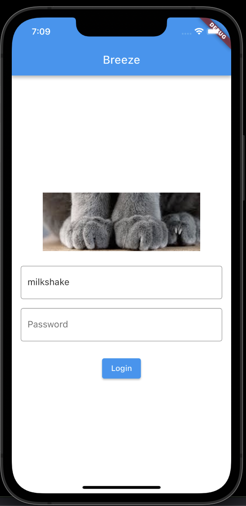
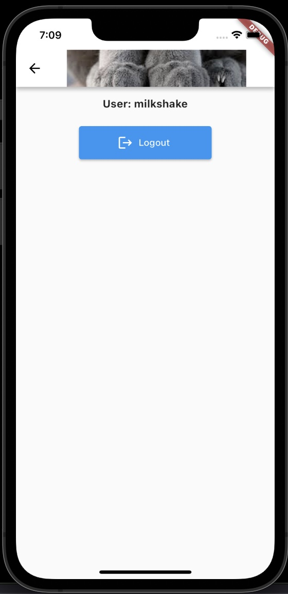
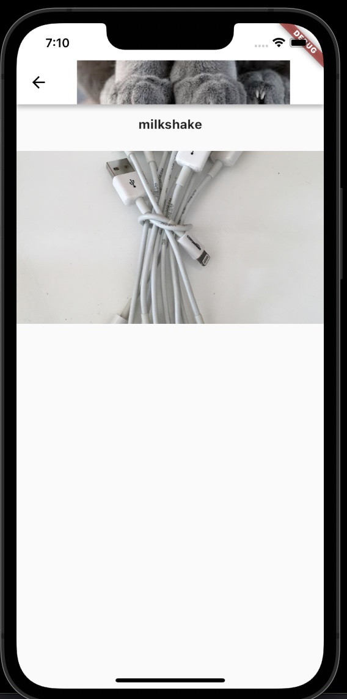
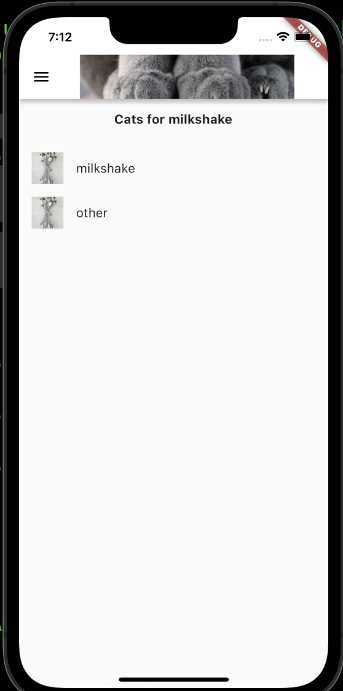

# flutter_breeze

This is a simple flutter app to present the user a login screen, make an HTTP
POST with the username and password entered and then display a list of items for
that logged in user.

There is a main logo image (assets/paws.jpg) and it also uses `cached_network_image` to load an image outset of assets via http.

The top bar has the logo and a menu icon. From menu you see who you are logged
in as and can log out.

The list of items lets you select one and goto a detail page for that item.

```
  http: ^0.13.3
  path_provider: ^2.0.5
  cached_network_image: ^3.0.0
```

# Run

```
flutter pub get
flutter devices
flutter run -d [your_device_id]
```

# iOS Screenshots



This is the login page from [lib/session.dart](https://github.com/andrewarrow/FlutterBreeze/blob/main/lib/session.dart) and it will make an http POST to `http://localhost:3000/api/login` and if it gets back a 200 with json like:

```
{"id": 1, "name": "something"}
```

You will have a logged in user like `final Map<String, dynamic>? user;` in [lib/index.dart](https://github.com/andrewarrow/FlutterBreeze/blob/main/lib/index.dart) and you can access the name field like:

```
user?['name'];
```

You'll see this in [lib/menu.dart](https://github.com/andrewarrow/FlutterBreeze/blob/main/lib/menu.dart) and notice the:

```
Navigator.popUntil(otherContext, (route) => route.isFirst);
```

Logic to get you back to the first screen. We pass around `otherContext` to each
screen so the Navigator can use just one context.

After login when you land on the HomePage it will make an http get to:

```
http://localhost:3000/api/cats
```

And expect some json like:

```
[{"id": 1, "name": "milkshake"},{"id": 2, "name": "other"}]
```

to make a list display of N items. It uses `GestureDetector` to know that you selected one and then opens a detail page for that selected item in [lib/cat.dart](https://github.com/andrewarrow/FlutterBreeze/blob/main/lib/cat.dart)





